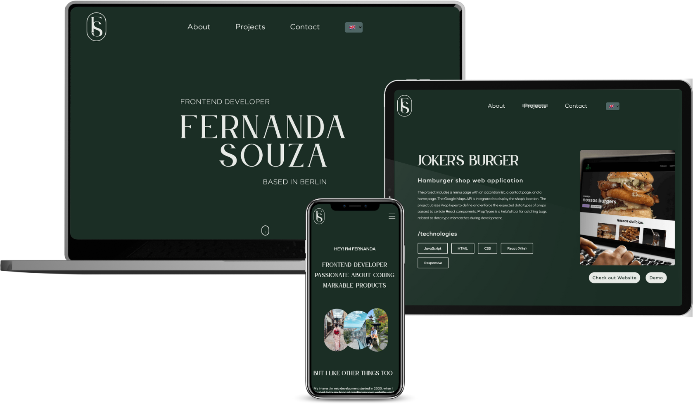

# Fernanda Souza - My Portfolio

Welcome to my personal portfolio website! As a frontend developer, I've built this site using React (Vite), JavaScript, HTML, and SaSS to showcase my skills and projects. Below, I'll provide you with an overview of the key features and technologies used in the development of this portfolio.

## Project Structure

- **Pages:**

  - `Home`: The home page serves as the initial landing page, offering a brief introduction and navigation to other sections of the website.
  - `About Me`: This section provides a glimpse into my background, skills, and experience as a frontend developer. Feel free to explore and learn more about me!
  - `Projects`: Browse through my showcased projects, each with its own dedicated page. The pagination component facilitates easy navigation through multiple project pages.

- **Key features:**

  - `Translation`: I've implemented a translation component using React's Context API, allowing users to switch between English (default language), Portuguese, and German seamlessly. This feature enhances accessibility and caters to a broader audience.
  - `Pagination`: The pagination component allows users to explore multiple project pages seamlessly. It ensures a smooth and organized presentation of projects.
  - `Back to Top Button`: Navigate back to the top of the page effortlessly with the Back to Top button. This feature improves user experience and ensures smooth navigation through lengthy content.
  - `Framer Motion Animation`: Using the Framer Motion library and the useInView hook, I've incorporated subtle animations that dynamically appear as users scroll through the content. This adds a touch of interactivity and engagement to the overall user experience.
  - `React Slick Slider`: For the technologies section, I utilized the React Slick library to create a slider. This was my first experience with the library, and its benefits include easy customization, responsiveness, and a smooth sliding experience for showcasing various technologies used in my projects.
  - `Responsive Design`: Ensuring a consistent and optimal viewing experience across various devices, the entire website is designed to be fully responsive.

## Deployment

The portfolio is deployed using Vercel, providing a fast and reliable hosting solution. Feel free to explore and interact with the website [here](https://jokers-burger.vercel.app/)!

## Demo Image

